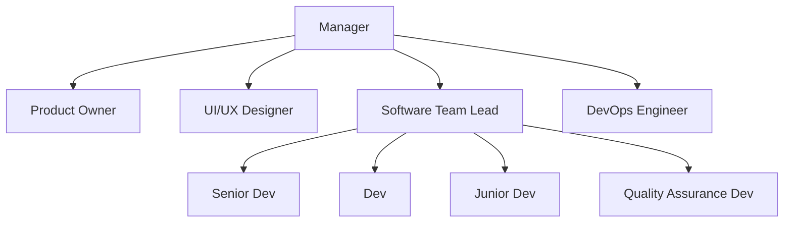

```table-of-contents
```

# The Software Organization Chart



# The Software Development Lifecycle

1. Planning and analysis
	- Involves the product owner, client, and manager
	- Goal: evaluate needs of end users and feasibility of project
2. Define requirements
	- Involves the product owner, client, and UI/UX designer
	- Goal: create clear requirements for the dev team
3. Design the UI and UX
	- Involves the product owner, client, and UI/UX designer
	- Goal: develop a high-fidelity prototype
4. Design and develop the code
	- Involves the software team lead, devs, and UI/UX designer
	- Goal: develop the actual product
5. Testing
	- Involves the QA dev, product owner, DevOps engineer, client, and devs
	- Goal:  make sure it work
6. Deployment
	- Involves the DevOps engineer, devs, product owner, and client
	- Goal: deliver the product to end users
7. Maintenance
	- Involves the DevOps engineer, devs, product owner, and client
	- Goal: keep it going

This lifecycle is iterative, in each step and as a whole system.
